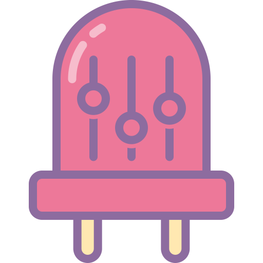

  

  <h3 align="center">light-controller</h3>

  

    Hobbyist control of WS2812 LED strips using holiday color palettes and a scheduler, all through a web interface
  

 

## Goals
- [ ] Rope light is modular so pieces can be hot-swapped
- [ ] Weather-proof/water-resistant
- [ ] Prioritize budget and simplicity over foolproofing
- [ ] Fully self-contained code (no cloud!)
- [ ] As close as possible to zero-config (easy deployment)
- [ ] Flexible enough to accommodate setups of all sizes
- [ ] >=15fps animations for ~1000 RGB LEDs

*Stretch goal:*
- [ ] Some sort of plugin framework, so I can make lights blink when my garage door opens, so I can see the door is opening from around the street corner

## Hardware setup
- Raspberry Pi 3 Model B+ for webserver, database storage, and light control
- [WS2812B individually addressable RGB leds strips](https://www.amazon.com/dp/B014QZNC1S/) (lengths of 5m, 30 LEDs/m, IP67 rated)
- Chinesium™ power supply: 5V 60A (peak 20ma/LED channel, 3 channels/RGB, 30RGB/m, 30m length = 0.02A×3×30×30 = 54A for lights, leaving 6A for Pi)
- Because of transmission loss over 30m (only one power supply and at one end only), a large gauge wire is needed for supply and ground lines...
- Some form of waterproof 3-pin connector (supply, ground, data) that can handle 60A×5V = 300W, for going between 5m lengths... ☹

## Software setup
- Some sort of transactional database
  - Maybe PostgreSQL
  - Maybe MySQL
  - Maybe SQLite
- Flask backend
- React frontend
